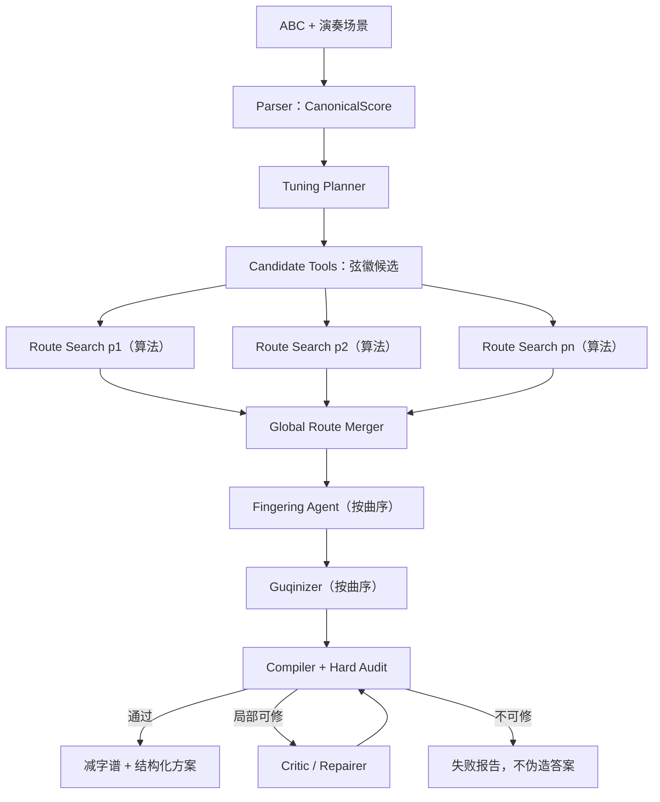

# ABC notation → 古琴减字谱 Agent 框架

> 讨论稿 v2，更新于 2026-08-14。本文先冻结一个简洁、可解释、可训练的框架；
> 代码实现与训练数据是否完全符合本文，单独在“实现状态”中说明。

## 1. 一句话设计

这个系统不是让一个大模型从 ABC 一次性猜出减字谱，而是：

> **确定性工具建立事实，少量专职 Agent 作选择，确定性审计证明结果成立。**

```text
ABC
  → 结构化乐谱
  → 是否需要调弦
  → 可弹通的弦徽主干
  → 古琴化处理
  → 编译与审计
  → 减字谱
```

系统只保留四个 Agent 决策阶段：

1. `Tuning Planner`：判断是否值得调弦；
2. `Fingering Agent`：在确定性弦徽路线之上补全、优化左右手基础指法；
3. `Guqinizer`：加入走手、吟猱、散泛变化等古琴化处理；
4. `Critic/Repairer`：只针对明确问题提出局部修复。

ABC 解析、候选生成、音高计算、状态继承、编译、重放和硬审计都不是 Agent，
而是确定性工具。

---

## 2. 为什么这样拆分

### 2.1 Agent 只处理存在选择的问题

以下问题有多种合理答案，需要 Agent：

- 正调资源是否够用，改弦是否值得；
- 同一音高用哪根弦、哪个徽位；
- 连续音如何减少换弦和大位移；
- 哪些地方适合散音、泛音、走手和韵指；
- 音高都正确时，哪条路线更连贯、更有古琴意味。

以下问题有确定答案，不应让 Agent 猜：

- ABC 中音符的音高、时值、小节和连音；
- 指定调弦下某弦某徽的实际音高；
- patch 是否真的应用成功；
- 减字谱能否回译；
- 是否出现缺音、增音、节奏变化或非法继承。

### 2.2 不把每个步骤都做成 Agent

角色过多会产生三个问题：

- 同一上下文被反复传递，token 浪费；
- 责任重叠，失败后不知道由谁修；
- 训练数据被切成许多没有独立意义的小对话。

因此总控是一个确定性状态机，不需要扮演“第五个专家”。Critic 也不是必经节点，
只有软指标较差或硬审计给出可修复诊断时才调用。

---

## 3. 最小架构



### 3.1 全局状态只保存六类对象

```json
{
  "score": "CanonicalScore",
  "tuning_decision": "TuningDecision",
  "phrase_handoffs": {"p0001": "PhraseHandoff"},
  "phrase_plans": {"p0001": ["PerformancePlanCandidate"]},
  "performance_plan": "PerformancePlan",
  "audit": "AuditReport"
}
```

自然语言只用于说明“为什么选择”；Agent 之间真正交付的是这些结构化对象。

### 3.2 对外状态采用中文线性谱面源码

内部 AST 保留精确字段；人和 Agent 默认阅读由 AST 规范化渲染的 `.gqs`：

```text
序号@事件ID｜目标音｜时值｜动作｜左手｜右手／续音｜技法｜谱面减字｜诊断
025@n00025｜G3｜八分｜按音｜大指按4弦七徽六分｜起音：勾4弦｜无｜
[大指七徽六分勾4弦]｜
026@n00026｜A3｜八分｜续音｜大指上至4弦六徽二分｜续音：承接a00025｜上｜
[上六徽二分]｜
```

谱面减字允许按继承规则省写；完整演奏状态已由“动作、左手、右手／续音、技法”等列和内部
AST 保存，不再重复生成一列完整减字。`025` 是显示行号，`n00025` 是 patch 使用的稳定事件 ID。

源码像编译器一样产生定位诊断：

```text
current.gqs:25:1  warning W307
  “吟”依附的余音时值较短。
Build finished: 0 error(s), 1 warning(s), 2 info(s)
```

### 3.3 Agent 通过编辑工具局部更新

Agent 不直接改 `.gqs` 或共享 JSON，而是调用 `edit_plan` 预览局部操作：

```json
{
  "base_revision": 3,
  "operations": [{
    "op": "add_technique",
    "action_id": "a00025",
    "expected": {"mode": "stopped", "string": 4, "hui": 7.6},
    "technique": "吟"
  }]
}
```

编辑器检查 revision、稳定 ID、前置字段和允许修改的字段。预览通过后，Agent 在最终输出中
提交同一 operations，由编排器原子提交新 revision，再重新渲染 `.gqs`。旧 revision 和 patch
不可变保存。过期 revision、前置条件不符或部分非法的批量编辑会整体拒绝，不产生半更新状态。

---

## 4. 五个阶段的职责

## 4.1 Tuning Planner：先判断要不要调弦

调弦不是“某个调对应某种定弦”的查表题。决策顺序必须是：

1. 先评估正调；
2. 检查主音、属音和高频重要音是否已有好用散音／泛音；
3. 判断曲目是否需要大量散音；
4. 区分独奏与合奏——独奏更需要古琴承担“底”；
5. 只有替代调弦的资源收益明显超过改弦成本，才离开正调。

输入：

```json
{
  "pitch_profile": {},
  "tonic": "C",
  "performance_context": "solo",
  "open_tone_demand": "auto"
}
```

可调用工具：

- `assess_retuning`
- `compare_tunings`

输出必须同时给出名称和七弦实际音高：

```json
{
  "retune": false,
  "selected_name": "正调",
  "open_midi": [48, 50, 53, 55, 57, 60, 62],
  "reason_codes": ["KEEP_STANDARD_SUFFICIENT"]
}
```

同名调弦可能存在音高变体，因此后续计算只信任 `open_midi`，不单独信任名称。

## 4.2 Route Search：用算法建立弦徽主干

这一步是纯算法：为每个 phrase 搜索散／按／泛、弦和徽位，返回 Top-K 路线及入口／出口
状态；只保证音高路线与位置连续性。这里不再设置一个名称含混的 Phrase Planner Agent。

Route Search 的职责：

- 为当前 phrase 选择散／按／泛；
- 选择弦、徽位；
- 联合考虑连续 2～8 个音，而不是逐音贪心；
- 返回 Top-K 路线和入口／出口状态。

它不负责臆造左右手指法，也不负责大量加入吟猱、走手或风格装饰。算法生成的
`left_finger`、`right_finger` 均为 `null`，在线性谱面中显示为“左手待定／右手待定”。
按音缺左手指法或起音缺右手指法都属于未完成状态，最终审计必须失败；编译器不得静默
补成“大指”或“挑”。续音动作 `attack=false` 不需要右手指法。

优化目标按优先级分层，而不是用一个含混总分掩盖错误：

```text
第一层硬约束：音高、节奏、攻击点、可演奏性
第二层连续性：换弦、徽位移动、方向反转、phrase 边界
第三层音色偏好：散按泛比例、音区、同音异位
```

硬约束不通过的路线不能靠“风格分高”补偿。

## 4.3 Global Route Merger：把局部 Top-K 合成一条全曲路线

Route Search 对每个 phrase 分别返回 Top-K。逐段选择各自排名第一的路线并不可靠：某段内部
最省力的出口，可能让下一段从很远的弦徽重新起步。Global Route Merger 的任务不是创造新
指法，而是在所有局部候选中选择一组**全曲总成本最低且边界连续**的组合。

这一阶段应是纯确定性算法，不调用大模型。原因是输入已经是有限候选集，目标函数和硬约束
可以完整写出；使用动态规划能够得到可重放、可解释的全局最优解。

输入是按曲序排列的 phrase Top-K；输出是每段唯一选中的路线、边界成本和全曲总成本。
它不选择左右手指法、不加技法、不改变调弦，也不创造候选集外的弦徽。

### 4.3.1 约束与成本

任何违反下列条件的组合直接淘汰，不进入加权评分：

- 每个含目标音的 phrase 恰好选择一条完整路线；
- 路线覆盖该 phrase 的全部攻击事件，事件顺序不变；
- 所有 candidate 都属于当前调弦且已通过音高工具验证；
- 相邻 phrase 的状态可以连接，不出现物理上无法在给定时间完成的位移；
- section 标记、休止和 phrase 边界不能被重排；
- 某个 phrase 没有可用路线时明确失败，不能返回一条不完整的“最佳路线”。

对 phrase 路线组合 `r₁…rₙ`：

```text
C_total = Σ C_local(rᵢ) + Σ C_boundary(exit(rᵢ), entry(rᵢ₊₁), Δtᵢ)
```

`C_local` 来自 Route Search；`C_boundary` 评价跨段的弦序、徽位移动、快速大位移和方向反转。

`Δt` 必须从 ABC 的真实时值和中间休止计算，不能固定写成一拍。长休止允许重新布置手位；
人工切出的 phrase 边界本身不应额外惩罚。右手指序尚未决定，因此本阶段不得虚构“连续挑”
之类的右手成本。

### 4.3.2 算法与输出

各 phrase 构成一个分层有向无环图：第 `i` 层的每个节点是一条局部路线，相邻层节点之间
是一条边界转移。若每段最多有 `K` 条路线，使用 Viterbi/动态规划即可在
`O(number_of_phrases × K²)` 时间内得到全局最优组合。

```text
dp[i, route] = local_cost(route)
             + min(previous_route) (
                   dp[i-1, previous_route]
                 + boundary_cost(previous_route, route)
               )
```

每个当前路线只保留一个最佳前驱，不需要 Beam Search。相同成本按稳定键
`(route.rank, candidate_ids)` 打破平局，保证同一输入总能得到相同输出。

空 phrase、只有休止的 phrase 和 section 标记不应清空最后一个有效演奏状态；它们只增加
可用时间。这样下一条有声路线仍与此前最后一个发声出口正确连接。

输出 `selected_routes` 以及 `local_cost`、`boundary_cost`、`total_cost` 和逐边界的 `available_beats/cost`。并行 Route Search 只生产局部 Top-K；Merger 是唯一的 reduce 阶段，确定全曲位置主干，后续 Agent 再按曲序补全左右手指法。

实现必须满足两个性质：空 phrase 不清空最后的有效演奏位置；在 Top-K 覆盖充分时，仅改变phrase 切分不应显著改变全曲路线。

## 4.4 Fingering Agent：补全可演奏的左右手指法

输入是 Global Route Merger 已选定的弦徽主干。Fingering Agent 按曲序运行，后一 phrase
读取前一 phrase 的完整已确认谱面，从而决定：

- 每个 `attack=true` 动作的右手指法；
- 每个按音的左手指法；
- 连续数音的勾、挑、抹、剔等组合与跨弦手势；
- 是否需要在音高不变的前提下局部改换弦徽；
- 哪些原本重复攻击的音适合留给后续 Guqinizer 改为走手。

它可调用 `expand_context`、`get_pitch_candidates`、`calculate_guqin_pitch` 和 `edit_plan`。
不得使用“大指／挑”作为无条件默认值；缺少必填指法必须留下错误诊断，不能宣称完成。

训练时标注片段只是教师的私有方向信息。Fingering 保持 Route Search 的模式、弦徽和攻击点，
生成音高正确、左右手完整且不含复杂技法的基础中间体；不同于标注但可演奏的指法仍然有效。

## 4.5 Guqinizer：在完整指法主干上做古琴化

输入必须是已经通过音高和节奏检查的完整主干。职责：

- 判断哪些音适合改为散音或泛音；
- 判断相邻音是否适合用上、下、进、退、绰、注连接；
- 在长音或语气允许时加入吟、猱、撞、逗等；
- 处理掐起、带起、抓起等依附动作；
- 保留 section、phrase 和攻击点。

每次修改都提交结构化 patch，而不是重写整段：

```json
{
  "patch_type": "ADD_TECHNIQUE",
  "source_index": 12,
  "after": {"technique": "吟"},
  "reason_code": "LONG_SUSTAIN_SUPPORTS_YIN"
}
```

Guqinizer 可以分多轮向标注靠近。单轮只要求修改合法、音高正确，并使当前方案与安全标注的
字段／技法差异严格下降；不要求一次完全复现最终谱面。

## 4.6 Critic / Repairer：诊断驱动的局部修复

Critic 默认不运行。只有出现以下情况才调用：

- phrase 边界跳动过大；
- 连续右手或左手动作明显不顺；
- 散音／泛音使用过多或过少；
- 技法与时值、音程或语气冲突；
- 硬审计给出可以局部修复的错误。

Critic 不直接重写全谱，只输出：

```json
{
  "diagnostic_code": "PHRASE_BOUNDARY_JUMP",
  "event_range": [31, 34],
  "evidence": {},
  "recommended_stage": "phrase_planner"
}
```

---

## 5. Phrase 切分与上下文交付

长谱可以分段，但状态不能被压缩字段意外丢失。Agent 直接读取可折叠的谱面序列：

```text
… <更早段：p0009，expand=context://score/Sxxx/phrases/p0009>
… <更早段：p0010，expand=context://score/Sxxx/phrases/p0010>
<前一段：p0011，已确认，只读>
118｜泛起挑4弦
119｜大指七徽六分勾4弦
120｜上至六徽二分
</前一段>
<当前段：规划中，可编辑>
121｜G3｜八分
122｜A3｜四分
</当前段>
```

前一 phrase 的完整减字序列是状态继承的事实来源。更早历史在主输入中只显示可用段数，不再
逐条列出 `expand=context://...` 链接；确有需要时，Agent 先调用 `list_context` 取得轻量目录，
再用 `expand_context` 只展开一个相关 phrase。没有后文预览。第一 phrase 只含当前段。

### 5.1 为什么保留完整前段

Agent 可以从原序列恢复散／按／泛、弦徽、`泛起／泛止`、余音技法和未完成走手，不要求
框架预先枚举所有状态字段。派生状态可以缓存和审计，但不能覆盖原序列。

### 5.2 section 边界不是自动清空点

`<一>`、`<二 红颜随虏>` 等是强切分信号，但不自动清空演奏状态。以下情况才覆盖或清空
相应字段：

- 长休止或明确终止；
- `泛止`；
- 新的显式左手位置；
- 新的明确散／按／泛标记；
- 规则明确要求结束的依附技法。

### 5.3 并行规划与顺序状态

Route Search 可以并行生成局部 Top-K；Global Route Merger 先确定位置主干。需要作音乐判断
的 Agent 随后按曲序运行，因此后一段总能看到前一段完整的已完成输出。训练 messages 使用
相同的顺序 teacher forcing；前段标注是合法历史，当前段答案仍不可进入输入。

---

## 6. 确定性工具

框架只需要六组核心工具：

| 工具 | 作用 | 能否由 Agent 改写结果 |
|---|---|---|
| `parse_abc` | ABC → CanonicalScore | 否 |
| `assess/compare_tunings` | 比较调弦资源 | 否 |
| `get_pitch_candidates` | 枚举同音异位 | 否 |
| `calculate_guqin_pitch` | 核验任意弦徽音高 | 否 |
| `expand_context` | 按折叠引用读取更早的只读谱面序列 | 否 |
| `list_context` | 只列出更早 phrase 的轻量目录，不返回动作 | 否 |
| `apply/replay_plan_patch` | 应用结构化修改 | 否 |
| `compile_and_audit` | 编译、回译、硬审计 | 否 |

候选是建议集，不是白名单。Agent 可以提出候选外位置，但必须调用
`calculate_guqin_pitch` 核验。

---

## 7. 一条完整示例

下面的例子只演示工作流，不宣称是唯一艺术答案。候选数字来自当前确定性音高工具。

### 7.1 输入 ABC

```abc
X:1
T:框架示例
M:4/4
L:1/8
K:C
C,2 D,2 E,2 G,2 | A,2 G,2 E,2 D,2 |
```

### 7.2 Parser：得到不可争辩的音乐事实

```text
n1 C, = MIDI 48，四分音符
n2 D, = MIDI 50，四分音符
n3 E, = MIDI 52，四分音符
n4 G, = MIDI 55，四分音符
n5 A, = MIDI 57，四分音符
n6 G, = MIDI 55，四分音符
n7 E, = MIDI 52，四分音符
n8 D, = MIDI 50，四分音符
```

这里不需要大模型判断。

### 7.3 Tuning Planner：先评估正调

正调七弦：

```json
[48, 50, 53, 55, 57, 60, 62]
```

这段旋律的 C、D、G、A 已有直接散音，正调资源充足。替代调弦没有足够收益，输出：

```json
{
  "retune": false,
  "selected_name": "正调",
  "reason_codes": ["KEEP_STANDARD_SUFFICIENT"]
}
```

### 7.4 候选工具：枚举关键音位

前三个音的部分候选：

```text
C3 / MIDI 48
  - 一弦散音，误差 0 cent

D3 / MIDI 50
  - 二弦散音，误差 0 cent

E3 / MIDI 52
  - 一弦十徽九分按音，误差 -2.832 cent
  - 一弦十徽八分按音，误差 +8.091 cent

G3 / MIDI 55
  - 四弦散音，误差 0 cent
  - 一弦九徽按音，误差 +1.955 cent
```

### 7.5 Route Search + Global Route Merger：选择弦徽主干

如果逐音只选误差最小候选，会频繁在散音和按音间切换。Planner 联合考虑整句，给出一条
可解释路线：

```json
[
  {"event":"n1", "mode":"open",    "string":1, "hui":null},
  {"event":"n2", "mode":"open",    "string":2, "hui":null},
  {"event":"n3", "mode":"stopped", "string":1, "hui":10.9},
  {"event":"n4", "mode":"stopped", "string":1, "hui":9.0},
  {"event":"n5", "mode":"stopped", "string":2, "hui":9.0},
  {"event":"n6", "mode":"stopped", "string":1, "hui":9.0},
  {"event":"n7", "mode":"stopped", "string":1, "hui":10.9},
  {"event":"n8", "mode":"open",    "string":2, "hui":null}
]
```

算法报告必须说明：

- n1、n2 使用自然散音；
- n3→n4 留在一弦并向上走位；
- n4→n5 在同徽换弦；
- 后半句形成近似回行；
- 所有按音误差在容许范围内。

### 7.6 Fingering Agent：补全左右手

Fingering Agent 读取相邻动作后补全指法。例如将主干中的 n3、n4 明确为“大指按，右手挑”，
n5 改用右手勾，以避免所有音机械地使用同一右手动作。每个选择以局部 `edit_plan` 提交；
若改换弦徽，可调用候选或音高工具取得辅助证据，但工具不是绝对裁判。专家模型可以依据古琴知识与上下文作出不同判断，并留下简短、可观察的理由。结构可重放、动作覆盖和必需指法完整仍是硬约束；未调用工具或工具给出音高警告本身不再导致轨迹被拒绝。

### 7.7 Guqinizer：只做有依据的修改

假设 n5 的时值与语气允许延续余音，Guqinizer 可以在该按音上加入轻微吟：

```text
原方案：二弦九徽勾
修改后：二弦九徽勾，随后作吟
```

它提交的不是整段新答案，而是：

```json
{
  "patch_type": "ADD_TECHNIQUE",
  "source_index": 5,
  "after": {"technique": "吟"},
  "preconditions": {
    "stopped_note": true,
    "sustain_exists": true,
    "duration_allows_ornament": true
  }
}
```

若节奏不允许，工具审计会拒绝该 patch，保留无装饰的按音。

### 7.7 Compiler：结构化方案变成减字谱

在暂不省写的情况下，可读形式类似：

```text
[散挑1弦]
[散勾2弦]
[大指十徽九分挑1弦]
[大指九徽挑1弦]
[大指九徽勾2弦+吟]
[大指九徽挑1弦]
[大指十徽九分勾1弦]
[散挑2弦]
```

正式输出先生成 `JianzipuIR`，再决定哪些字段可按继承规则省略。不能直接让模型拼减字谱字符串。

### 7.8 Hard Audit：最后证明没有走样

审计逐项检查：

```text
音高：8/8 可解释
节奏：攻击点和延音关系合法
继承：省略字段可从状态机唯一恢复
可演奏性：无非法弦号、徽位或泛音位置
结构：小节和 phrase 未丢失
```

只有全部硬约束通过，结果才进入最终输出。风格分低可以继续优化，但不能把音高错误当作
“另一种艺术选择”。

---

## 8. Agent messages 的训练格式

训练的是可观察决策轨迹，不训练隐藏思维链：

```text
system：角色和硬约束
user：PhraseHandoff + 当前方案
assistant：简短决策摘要 + tool_call
tool：真实确定性结果
assistant：基于结果继续调用或提交 patch
tool：重放／审计结果
assistant：最终结构化答案
```

教师模型可以看到私有标注来规划一条高通过率轨迹，但公开训练 messages 必须满足：

- 当前段标注答案不出现在 user 输入；
- 工具必须真实执行；
- 后续摘要必须与工具结果一致；
- 最终 patch 可重放；
- 教师私有文件与学生训练文件物理隔离。

教师生成与学生训练使用两层协议，避免 MiniMax 同时生成严格文本 JSON 和 API 原生工具块：

```text
MiniMax 教师每轮：{"decision_summary": "…", "tool_calls": [{"name": "…", "arguments": {…}}]}
                         ↓ 真实执行工具；通过的 edit_plan 即为提交并终止
Qwen 训练 messages：assistant.tool_calls → tool（未通过则继续；通过则终止）
```

工具 Schema 序列化在教师 system 的 `tools` 字段中。教师不生成额外的 `final`；通过审计的
`edit_plan` 由运行器直接提交，训练 messages 可以自然终止于最后一批 tool 结果。教师原始 JSON、请求和回复只保存在
私有审计文件；公开训练数据不重复保留文本形式的 `tool_calls`。成功与失败尝试均须留下真实
输入输出，失败尝试写入 `teacher_rejected_io.jsonl`。

---

## 9. 失败与修复

失败按诊断路由，不把整首曲从头重跑：

| 诊断 | 返回阶段 |
|---|---|
| 调弦下无可用音位 | Tuning Planner / Candidate Tool |
| 单音音高错误 | Route Search / Fingering Agent |
| phrase 边界跳动 | Global Route Merger / 相邻 Fingering Agent |
| 走手破坏攻击点 | Guqinizer |
| 继承无法唯一恢复 | Guqinizer / Compiler |
| 只有风格指标偏低 | Critic |

每次修复有次数上限；超过上限就输出失败报告，不静默生成错误减字谱。

---

## 10. 评估

硬指标：

- 音高正确率与覆盖率；
- 节奏／攻击点保持率；
- 减字谱回译成功率；
- patch 重放成功率；
- 非法弦徽和继承歧义数量。

软指标：

- 平均换弦与徽位移动成本；
- phrase 边界连续性；
- 散／按／泛资源使用；
- 技法与时值、音程和语气的适配；
- 与标注语料“韵”分布的距离；
- 琴家盲评。

validation 用于调参和早停；test 只保留输入—标注配对并计算指标，不展开为训练数据。

---

## 11. 当前实现状态

截至 2026-08-14：

- 已实现 LangGraph 编排、ABC 解析、调弦评估、弦徽候选、Top-K 路线、全局合并、编译、
  审计、patch 重放和有限修复；
- Route Search 只生成散／按／泛、弦和徽位，左右手指法显式保留为待定；只有 Agent
  补全后才能通过最终审计，编译器不再使用“大指／挑”默认值；
- 241 首已生成无损整曲 `teacher.gqs`；新版由其直接生成 4,855 条 phrase，全部不超过
  32 个有声音符；
- 4,855 条 phrase 通过“完整前段 + 每个更早段独立 expand 引用”连续性审计；无后文预览；
- 1,192 条严格合格 train phrase 已生成 2,403 条 v3 messages：Fingering Agent 973、
  古琴化 238、审计 1,192；Guqinizer 仅接收前置左右手已经完整的样本；
- 当前运行时的古琴化规则仍不完整，Critic 的音乐性评价仍以代理指标为主；
- 并行 Route Search 只计算局部候选，唯一出口在全局合并后确定；Fingering Agent 与
  Guqinizer 按曲序运行，训练 messages 采用同样的顺序 teacher forcing。
- 在线模型工具轮次默认上限为 24，可用 `AGENT_MAX_TOOL_ROUNDS` 调整；上限是防失控保护，
  不是要求模型用满。局部修改应按事件或短窗口成组提交，避免机械地逐字段调用工具。

最新数据规模、复现命令和风险见
[agent_training_handoff.md](agent_training_handoff.md)；训练与评估安排见
[agent_training_experiment_plan.md](agent_training_experiment_plan.md)。

---

## 12. 仍需共同决定的问题

1. 调弦决策是否只在整曲开始执行一次，还是允许 section 级移调但禁止中途改弦？
2. “韵”的第一版奖励应采用哪些可计算代理，哪些必须留给琴家评价？
3. messages 中决策摘要应多短，才能既可解释又不让模型学习空泛套话？

在这些问题确定前，框架保持最小角色集合，不继续增加新的 Agent 名称。
