guqin实验日记

## 20260729

我在ABC_J\final\SBAwX43Q\jianpu_jianzi_mapped.md中找到很多没有映射成功的减字；
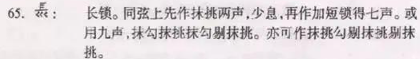
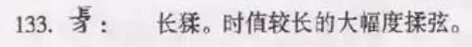
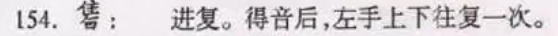
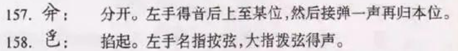
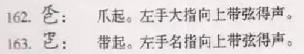
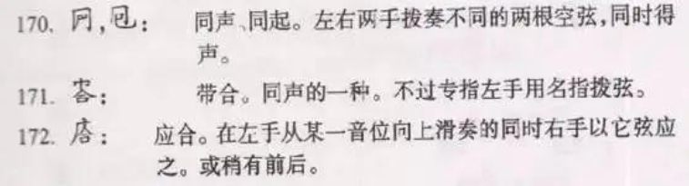
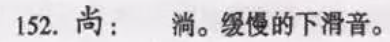
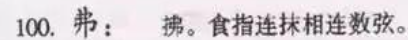
都来自https://zhuanlan.zhihu.com/p/667794516 ，免得我老是去问师兄

li是歷，:dq是带起，:sx是至，o是托，csuo是长锁，j:是进，gq是勾剔，:fenk是分开；进复会被错翻成进拂（这原因可能有些复杂），td:是淌，t:是退，:wl是往来，长猱被翻译成了猱搯（第110个音| 110 | 3̇ | d'2 | 八分 |  | 猱搯 |），:zq是爪起，:ts是同声

codex老是更新额度，太好了，以后放心用

在流水（ABC_J\final\S45fs5uq\jianpu_jianzi_mapped.md）中找到一些映射缺失的减字：

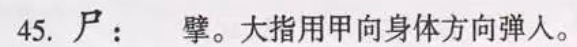
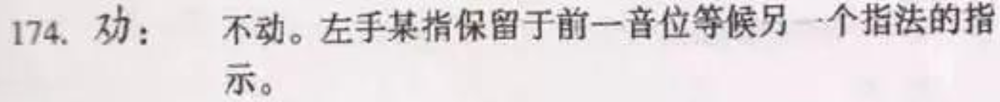
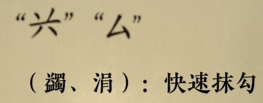
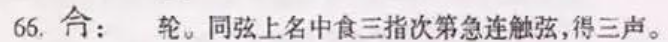
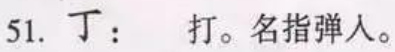
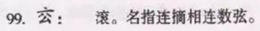
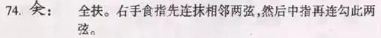
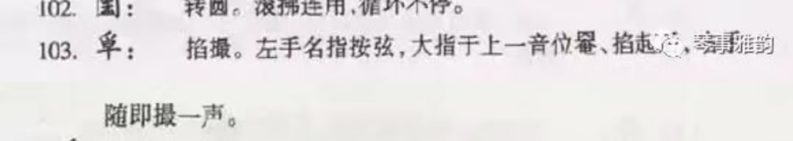
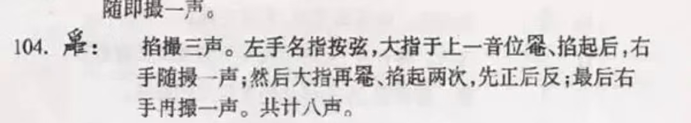

b是擘，:bd是不动，j是涓，lun是轮，:k是一个位置标记，几个音之后有一个:zkez，表示从:k再作，即从:k标记的那个音那里，到这里，中间的减字，再重复两次:zksz表示从:k标记的那个音那里，到这里，中间的减字，再重复三次；yu:是引上，gun表示滚,:ztzz表示从头再作，从头到这里的减字再重复一次；qf是全扶，:tcss表示掐撮三声

广陵散ABC_J\final\SMcjde29\jianpu_jianzi_mapped.md
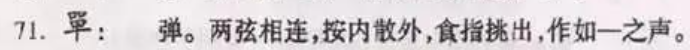
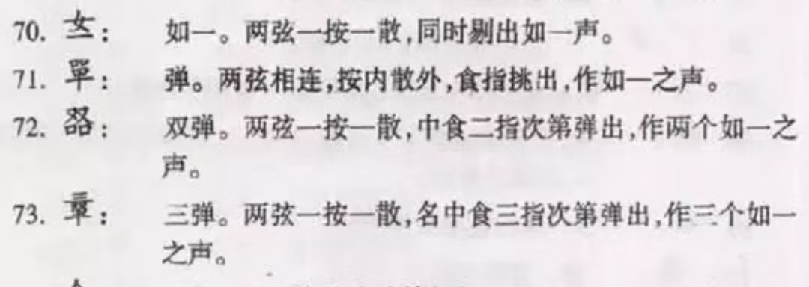

## 20260730

大胡笳节本ABC_J\final\S4nhaTGN\jianpu_jianzi_mapped.md


pt:是弹，但是注意是一个同时弹两根弦的动作，如广陵散 SMcjde29	第2音	勾2弦 → 弹（食指四徽2弦+ 食指四徽1弦），
yl是圆搂
为什么第七个音| 7 | 3<br>6̣ | [Gd]4 | 四分 |  | 撮[47<br>停<br>至 |会被翻译成这样？怎么会有一个中括号？应该是撮（散音4弦+散音7弦）少息
pet:是双弹，| 31 | 6<br>1 | [Bg]2 | 八分 |  | pet:大指965 |应该是双弹（大九徽6弦+散5弦）
| 52 | 1̇<br>1 | [Bb]2 | 八分 |  | 撞 |不应该翻译成“撞”，应该是再作；
fu是拂，| 65 | 1̣ | B, | 十六分 |  | fu1弦 |应该是散拂1弦
zd:是注下
pst应该是三弹

撮是勾挑组合，圆搂是抹勾组合，衔接指法不同，音色一样

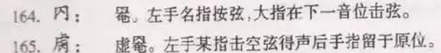
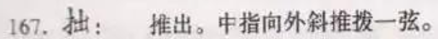
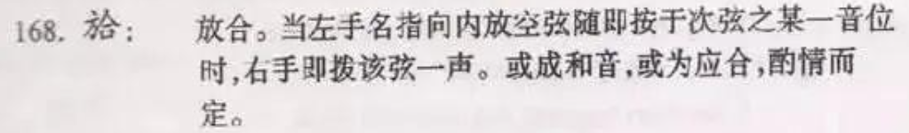
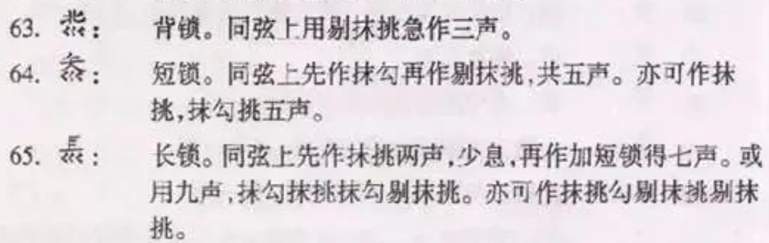
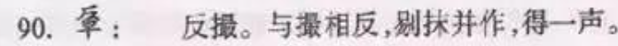
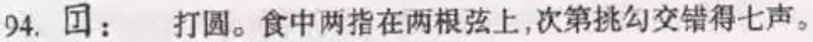
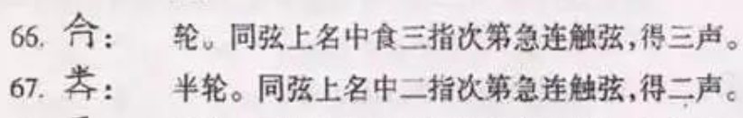
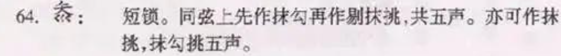
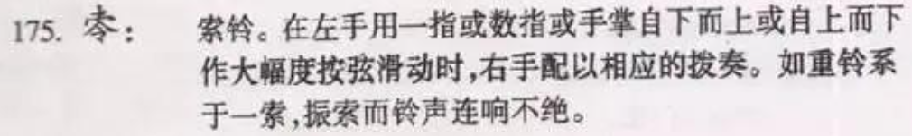

y是罨，d是打，:zkzz是从ㄱ再作，:yh是应合，xy是虚罨，:tc是推出，:fh是放合，:ji是急；:ry是如一；bsuo是背锁，:fc是反撮，mg是抹勾，:dy是打圆，suo是锁，blun是半轮，:quz是曲终，dsuo是短锁，:sl是索铃，:st是双弹

《普庵咒》索引 43（第 44 音）：:sl提取出来是| 43 | 0（休止） | z4 | 四分 |  | :sl |，这个为什么简谱的音错了，本来应该是5̇ 


另外，所有的装饰音好像都没有提取出来，如S7mY2frJ的 | 11 | 6̣̣ | D,2 | 八分 |  | 勾2弦 |
| 12 | 2̇ | g | 十六分 |  | 绰上五徽六分 |
中间本来应该还有一个大六二轮7
；
以及一些“绰（上）”没有提取出来，如ABC_J/final/SZ7pMCs3/jianpu_jianzi_mapped.md的| 25 | 5 | c | 十六分 |  | 大指七徽挑6弦 |,本来应该还有一个绰，大指七徽挑6弦

以及，曲S7mY2frJ的定弦明明不是全0，但是文件ABC_J/final/S7mY2frJ/jianpu_jianzi_mapped.md显示：| 调弦 tuning | 正调 [0, 0, 0, 0, 0, 0, 0, 0] |；

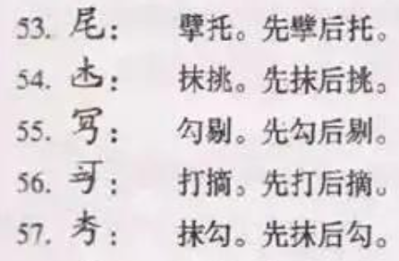
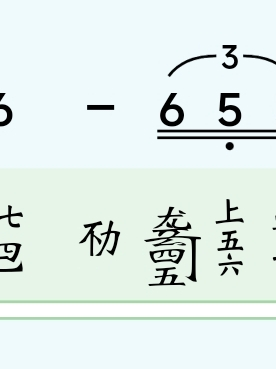

- [ ] yj是不是摘涓，还得问问师兄

sry:是散如一；t=f:表示泛音，d=dz表示打摘，d=yj应该是摘涓

## 20260802

师兄推荐了一套移植课，感觉很有用，先下载下来（百度网盘），然后研究一下

当前所有古谱选哪些id都确定了吗？没有；先确定下来，一劳永逸


## 20260803

SNt85j0u阳关三叠，abc notation谱中，怎么会有那么多逗号

有一些居然连减字谱都没有

score_key 和 score_id 都能标识一份曲谱，但用途不同。
- score_key：对外使用的短字符串，例如 SM5DzP0L
常见于分享链接：app.sitongli.net/scores/SM5DzP0L
适合分享、页面跳转和公开引用
通常可以从 App 的分享功能直接读到
- score_id：服务器内部使用的数字编号，例如 10916
常见于数据接口：/v2/scores/10916/data
App 请求曲谱正文、打开内部页面时主要依赖它
我们的运行时采集也用它打开指定曲谱


## 20260807

每个markdown生成了链接，方便手机查看、核对

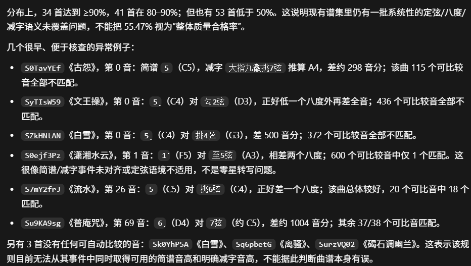

古怨的前两个音目前提取是[大指九徽挑7弦] [勾5弦]，但是根据DOCS\inherit_rule.md，这第二个音会被当作按音（不知道[audit_jianpu_jianzi_pitch.py](scripts/audit_jianpu_jianzi_pitch.py)是如何看待的），但是实际琴谱，应该是散勾5弦；我怀疑scripts\extract_jianpu_jianzi.py遗漏了散音标志

为什么忆故人这首曲子（ABC_J\final\SApzZmDj\jianpu_jianzi_mapped.md），和我手机上打开的对不上？我手机上看到的前几个音是：[泛起食指七徽勾4弦][勾5弦][大指七徽勾7弦][名指九徽勾4弦]？你再采集一下试试？我手机上打开的链接是（https://app.sitongli.net/scores/SApzZmDj?shareid=85502 ）
重新采集了一遍就好了

是否还有其他的这样的情况？
codex很聪明，它做了一遍哈希：
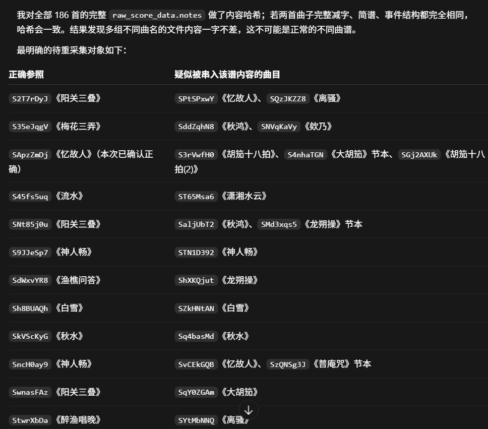

## 20260809

不能在数据准备阶段耽误太久；必须先做一个demo，慢慢完善。。。
应该准备agent框架的代码了，然后在框架上造训练数据

在一些比较长的谱子（比如S0ejf3Pz《潇湘水云》中），APP的显示界面会有分节，比如[ 一 ]或者有时会有文字，比如S4nhaTGN《《大胡笳》节本》的 [ 一 ] 红颜随虏 、 [ 二 ] 归去梦来；不知道源数据中是否有，感觉对后续单条数据划分会比较重要

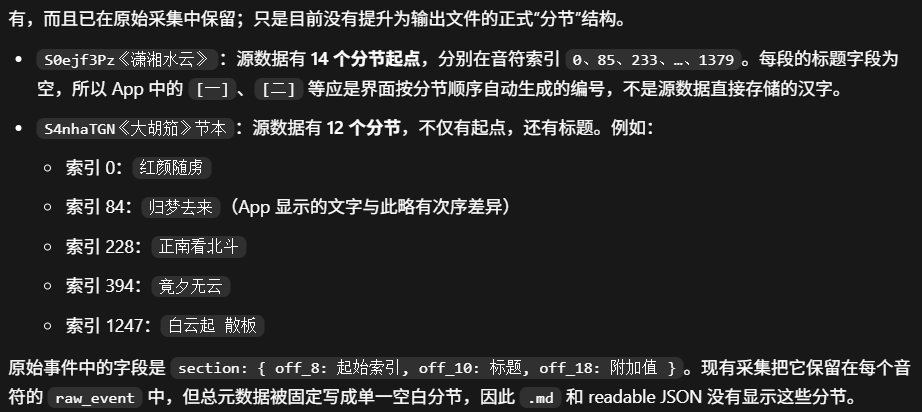


我想在最终输出文件中体现这点，减字谱中可以使用像<一>或 <一 红颜随虏>这样的标记；然后abc notation中也可以加特殊的标记；因为后续我可能会对单条数据进行切分来训练模型，这天然提供了切分信号；让codex帮我设计一下，然后重新生成最终文件

ABC_J\final\S3gMUKsg\jianpu_jianzi_mapped.md的[走手[大指6273散]，首先中括号不对没有闭合；其次翻译不对，应该是反撮[大指六徽二分7弦+3弦散音]


## 20260810

现在核心目标是构建agent训练数据；
1. 确定下来agent框架
2. 设计评估指标，并在已有的标注好数据上计算指标分数；指标需要同时考虑音高匹配率、量化“韵”等）
3. 用agent框架接api，跑两条数据看看效果（计算分数，和标注数据的分数对比）；
4. 划分训练、测试数据
5. 设计算法，利用已有的数据，构建agent轨迹
6. 训练模型
7. 测试

## 20260812

添加了《神奇秘谱》中的（且之前没有在seeds.txt中）一些谱名，并全部抽取出来；
修复了找不到score id的情况（通过回退）

生成了ABC_J/results/dataset_split_groups.csv方便测试数据集划分（避免泄露）
ABC_J\build_unified_lineage.py

scripts\backfill_inferred_tunings.py是通过调弦名字（如正调、紧二五、紧二五七、慢三弦等）反推调弦数组的脚本

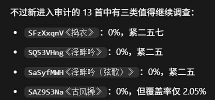
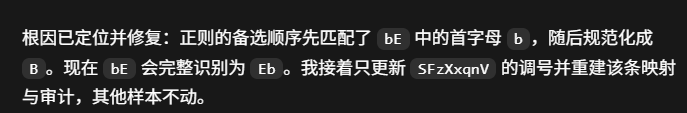

## 20260814

今天疯狂完善agent，这是我们的理论基础、护城河、投入回报比高

## 20260821

.gqs格式存储编辑渲染

调弦轨迹可以先不管、后续再补一个单独的调弦agent；


221｜2｜G2｜八分｜泛音弦待定｜无｜续音｜无｜:tcsi
没找到这个谱

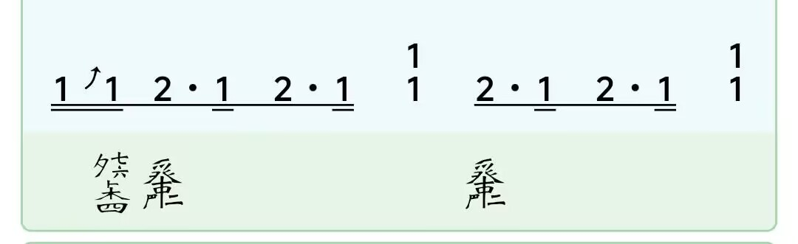
:tples是掐拨剌二声；
ABC_J\final\SyTIsW59\jianpu_jianzi_mapped.md中的:tflss是掐拂歷三声

## 20260902
师兄说减字的丰富性是衡量移植谱的一个重要指标、很多人，或者自动转换减字谱的程序，为了图省事，会只在一根弦上反复弹奏，就会显得单调

第一轮训练已经完成，loss从首个记录点：约 0.724降到最后记录点：约 0.234
发现一百多条数据有问题，还是要重训一下

我发现有些轨迹中有一些最终结果是撮三六、撮三七三这种“撮+2-3个中文数字”的、质量低、得重新生成


脚本和用法如下。

评估主脚本：

[eval_two_stage_score.py](D:\sitongli\sitongli-guanshanyue\train\scripts\eval_two_stage_score.py)

它按每首曲谱执行：

`Base → Guqinizer → 下一 phrase`

并使用模型自己上一段的结果作为下一段只读前文。

服务器批量入口：

[run_post_train_eval.sh](D:\sitongli\sitongli-guanshanyue\train\server\run_post_train_eval.sh)

默认使用：

- 评估输入：`train/eval_inputs_v2_text_protocol/`
- 输出目录：`train/eval_outputs/`
- 最大生成长度：`10240`
- 工具轮数：8
- 每段重试：2 次
- 设置两张 GPU 时，validation/test 会同时运行
- `--resume` 支持断点续跑

服务器上运行：

```bash
cd ~/guqin-agent
CUDA_VISIBLE_DEVICES=0,1 \
ADAPTER=~/guqin-agent/train/output/你的适配器目录 \
bash train/server/run_post_train_eval.sh
```

如果需要先生成无标注评估输入：

[build_public_eval_inputs.py](D:\sitongli\sitongli-guanshanyue\train\scripts\build_public_eval_inputs.py)

```bash
python train/scripts/build_public_eval_inputs.py \
  --source-dir agent_training/evaluation_pairs \
  --output-dir train/eval_inputs_v2_text_protocol
```

评估结果下载回本地后，用封存标注评分：

[score_agent_predictions.py](D:\sitongli\sitongli-guanshanyue\train\scripts\score_agent_predictions.py)

```bash
python train/scripts/score_agent_predictions.py \
  --reference agent_training/evaluation_pairs_validation.jsonl \
  --predictions train/eval_outputs/validation_predictions.jsonl \
  --output train/eval_outputs/validation_scores.json
```

测试集同理替换为 `test`。


--allow-private-reasoning-leakage + 脱敏

至少匹配一个音高来筛选phrase：
统计：
scripts/audit_training_phase_pitch_parse_stats.py
筛选：
`D:\sitongli\sitongli-guanshanyue\ABC_J\scripts\export_pitch_eligible_trajectories.py`

已完成导出并上传，筛选采用“同一 phrase 的两个阶段都符合条件”的严格成对规则。

筛选结果：

- phrase：4,039
- Fingering：4,039
- Guqinizer：4,039
- 总轨迹行：8,078
- 排除：267 个 phrase（涉及 373 个完全不匹配阶段）

完整公开版（本地）：

`D:\sitongli\sitongli-guanshanyue\ABC_J\agent_training\messages_repeat_semantics_pure_cuo_repaired_final_v3_public\messages_train.jsonl`

筛选版（本地）：

`D:\sitongli\sitongli-guanshanyue\ABC_J\agent_training\messages_repeat_semantics_pitch_eligible_v1\messages_train.jsonl`

筛选 phrase ID：

`D:\sitongli\sitongli-guanshanyue\ABC_J\agent_training\messages_repeat_semantics_pitch_eligible_v1\pitch_eligible_phrase_ids.txt`

筛选清单：

`D:\sitongli\sitongli-guanshanyue\ABC_J\agent_training\messages_repeat_semantics_pitch_eligible_v1\selection_manifest.json`

服务器完整公开版：

`/home/20223393ljw/guqin-agent/agent_training/messages_repeat_semantics_pure_cuo_repaired_final_v3_public/messages_train.jsonl`

服务器筛选版：

`/home/20223393ljw/guqin-agent/agent_training/messages_repeat_semantics_pitch_eligible_v1/messages_train.jsonl`

服务器 phrase ID：

`/home/20223393ljw/guqin-agent/agent_training/messages_repeat_semantics_pitch_eligible_v1/pitch_eligible_phrase_ids.txt`

服务器文件已与本地 SHA-256 核对一致。错误 `~` 路径下的重复上传副本也已清理。


轨迹与状态对比标注表的可视化脚本：
`scripts/visualize_all_trajectories_hierarchical.py`

感觉batch=32时，损失很难降(到0.3左右)；改成batch=16时好了一些(到0.27左右)；把batch size改成8(也就是梯度累计改为4)再试试，毕竟max_token有8192，这里监督信号太多了
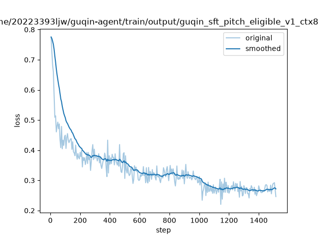

评估时记得设置max token = 10240

模型陷入低熵退化循环：
```
工具反馈显示序号7、11、20不可编辑。这些是延音行，可能系统不允许直接编辑。根据规则，延音行的减字处理应由系统自动完成，或者这些行不应提交。让我重新提交，排除这三个延音行，只提交其他需要修改的行。
</think>

收到反馈：序号7、11、20不可编辑（可能是系统保留的延音行）。根据规则，这些延音行的减字处理应由系统自动完成。重新提交其余需要修改的行，排除这三个延音行。
</think>

排除不可编辑的延音行（7、11、20），重新提交其余需要修改的行。
</think>

排除不可编辑的延音行（7、11、20），重新提交其余需要修改的行。
</think>

排除不可编辑的延音行（7、11、20），重新提交其余需要修改的行。
</think>

排除不可编辑的延音行（7、11、20），重新提交其余需要修改的行。
</think>
......
```

模型训练完推理时，进入一个这样的循环，codex跟我说：
会和 `think` 边界有关，但 `think` 不是根本原因；这是典型的确定性解码重复循环。

具体过程是：

1. Qwen3.5 的 thinking 模板负责思考区间。解码结果里第一次出现 `</think>` 通常是正常结束思考。
2. 模型收到“7、11、20 不可编辑”的工具反馈后，形成了一个很短、概率极高的回答模式：
   `排除这些行 → 重新提交 → </think>`
3. 但模型没有继续生成 `<tool_call>`，而是再次回到相同句子。
4. 当前使用 `do_sample=false`，一旦走进这个高概率循环，每次都会选同样的下一个 token。
5. `repetition_penalty=1.04` 太弱，没有把循环打断；`max_new_tokens=10240` 又允许它持续很久。

实测这一轮：

- 同一句话重复约 389 次；
- `</think>` 出现 391 次；
- `<tool_call>` 为 0；
- 没有输出 `<|im_end|>`。

训练源数据的 21,418 个 assistant 回合中，字面上的 `<think>` 和 `</think>` 都是 0 次，因此不是训练数据直接教会它重复 `</think>`。这些标签主要来自 Qwen 模板/推理协议。

这次循环的直接诱因还是错误的工具反馈：7、11、20 本来是可编辑的延音行，却被旧评估 scaffold 拒绝。这个问题刚刚已经修复；模型不再需要进入“排除延音、重新提交”的分支。

但仍建议给生成器增加重复检测作为保险：

- 连续重复相同短语或高重复 n-gram 时提前停止；
- 将该轮标记为 `repetition_loop`；
- 不把异常输出加入上下文；
- 直接重新生成该轮；
- 继续保留 `max_new_tokens=10240`，不影响正常长推理。

所以结论是：`</think>` 是循环中的明显症状和锚点，但主要问题是错误反馈触发了低熵循环，而确定性解码又无法自行脱离。
建议：不要全局关闭 thinking，也不要从第一轮开始就 `do_sample=true`。最合适的是“确定性首试 + 异常时采样重试”。

当前代码的问题是：

```
do_sample = attempt > 0
```

这次运行用了 `--attempts 1`，所以所有轮次始终是 `do_sample=false`。Guqinizer 第 2 轮进入循环后，没有采样重试机会。

推荐策略：

- 正常首轮：`do_sample=false`，保证工具参数和格式稳定。
- 检测到重复循环：立即中止该轮，不加入上下文。
- 原上下文重试：`do_sample=true`、`temperature=0.25~0.35`、`top_p≈0.9`。
- 若再次循环，再提高一点温度或开启下一次完整 attempt。
- `max_new_tokens` 仍保留 10240。

不建议关闭 thinking，原因是：

- 训练数据监督了 reasoning + tool call；
- Guqinizer 确实需要逐音分析；
- 关闭 thinking 会造成训练与推理模板不一致；
- 可能减少循环，但也可能让工具选择和复杂技法质量下降。

可以只在两个地方关闭或跳过 thinking：

- `edit_plan` 已经成功后的最终确认回复；
- 重复重试多次仍失败时，作为最后的降级方案。

而且这次循环的直接诱因——延音行被误判不可编辑——已经修复。再加上重复检测和采样重试，通常不需要关闭 thinking。

好烂啊；再训一次？要不要重新生成一遍数据呢？

## 20260905

### 训练模型的纠正警告的能力：
“要求下一轮修复”是两层机制，不只是加一句提示词。

第一层是程序强制阻止结束：

- 工具返回 `jianzi_pitch_mismatch` 后，把对应音序放入 `pending_pitch_warning_events`。
- 只要这个集合非空，就将 `accepted_preview = None`，即使 `edit_plan` 本身校验通过，也不能结束轨迹。[代码位置](/Volumes/F/work/Gunqin-agent/scripts/generate_teacher_tool_trajectories.py:1640)

第二层是在下一次 GLM 请求中追加一条 `role=user` 的内部控制消息：

```text
编辑工具仍报出音高不匹配。你已经查看过这些音的候选；
请根据候选对音序 [...] 至少进行一次修复性 edit_plan，
只提交需要变化的行。即使判断警告可能来自复杂技法，也必须先尝试修复。
```

如果此前没有查过这些音，则改成要求先调用 `get_pitch_candidates`。[代码位置](/Volumes/F/work/Gunqin-agent/scripts/generate_teacher_tool_trajectories.py:1710)

随后程序还会验证：

- 新一轮 `edit_plan` 是否真的包含报错音序；
- 候选查询是否发生在这次修复编辑之前；
- 修复编辑是否发生在 warning 之后。

只有满足这些条件，才从 pending 集合移除该音序并允许结束。[代码位置](/Volumes/F/work/Gunqin-agent/scripts/generate_teacher_tool_trajectories.py:1630)

这里刻意使用 `role=user`，而不是伪造一段 `role=assistant`：这条控制消息只进入教师模型的请求上下文，不写入公开训练轨迹。公开轨迹呈现的是：

```text
assistant 调用 edit_plan
→ tool 返回 warning
→ assistant 自己说明判断并执行修复 edit_plan
```

因此学生最终学到的是模型真实生成的 warning 后修复行为，而不是我们硬拼出来的 assistant 回答。

现在主要的音高是正确的、但是guqinizer阶段性能很差；目前主要想法是在教师模型的私有提示中，加强对复杂技法用法的解释

SywB9Jym-p0017 lj是啥

目前的一个问题是，虽然base阶段能做到大部分音高是正确的、但是模型似乎学不会第二阶段（guqinizer阶段），主要体现在一些错误上，比如[绰上四徽]这种，他的前一个音和这一个音在同一根弦上才能使用，但是模型显然不知道；再比如，掐撮三声，一般要求前一个减字的动作是撮，这样才知道具体是如何掐撮，比如[撮（名指九徽7弦按音＋5弦散音）] [掐撮三声]；我的设想是、第二阶段教师轨迹生成时要再详细一些；首先就是目前已有的复杂指法解释注入私有提示词机制，可能这个解释还要详细些才行；要人工完善一下那个映射文件；

scripts/generate_teacher_tool_trajectories.py:381–424：加载 JSONL 映射
scripts/generate_teacher_tool_trajectories.py:432–455：匹配指法并注入私有提示词
scripts/generate_teacher_tool_trajectories.py:1512：将解释加入教师提示

/Volumes/F/work/Gunqin-agent/agents/abc_to_jianzipu/knowledge/complex_fingering_explanations.jsonl


SrvncV5U-p0001我看出来点问题：从第1个音开始模型就给出”泛起食指七徽勾一弦“，但是后续模型还是给出“泛擘六弦七徽”：但是前面的泛起可以省略这个泛字、前一个音是大指七徽挑五弦，所以七徽也可以省略；

泛音段如何表示按音呢？

## 20260911

感觉重跑了一遍guqinizer数据构造没有什么明显的质的提升
目前还有一些曲谱不对；这些曲子出来的轨迹到底有没有用呢？

打/涓这种还是不对啊，